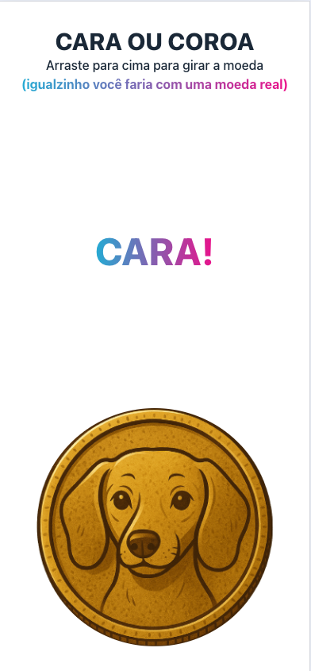

# 🪙 Heads or Tails 🇺🇸 (en-US)

A **Heads or Tails** web app, built with love using React, TypeScript, and Tailwind CSS.

## 📸 Preview



## 🚀 Technologies Used

- [React 19](https://react.dev/)
- [TypeScript](https://www.typescriptlang.org/)
- [Vite](https://vitejs.dev/)
- [Tailwind CSS](https://tailwindcss.com/)
- [clsx](https://github.com/lukeed/clsx)

## 💡 Features

- Flip a virtual **coin** with just one click
- Modern and responsive interface powered by Tailwind CSS

## 🛠️ Installation

1. Clone the repository:
   ```bash
   git clone https://github.com/your-username/coin-flip.git

2. Install the dependencies:
   ```bash
   npm install

3. Run the development server:
   ```bash
   npm run dev

# 🪙 Cara ou Coroa 🇧🇷 (pt-BR)

WebApp de **cara ou coroa**, desenvolvido com Amor, React, TypeScript e Tailwind CSS.

## 📸 Preview


## 🚀 Tecnologias utilizadas

- [React 19](https://react.dev/)
- [TypeScript](https://www.typescriptlang.org/)
- [Vite](https://vitejs.dev/)
- [Tailwind CSS](https://tailwindcss.com/)
- [clsx](https://github.com/lukeed/clsx)

## 💡 Funcionalidades

- Sorteio entre **cara** ou **coroa** com apenas um movimento
- Interface moderna e responsiva com Tailwind CSS

## 🛠️ Instalação

1. Clone o repositório:
   ```bash
   git clone https://github.com/seu-usuario/coin-flip.git

2. Instale as dependências:
   ```bash
   npm install

3. Rode o projeto em modo de desenvolvimento:
   ```bash
   npm run dev
